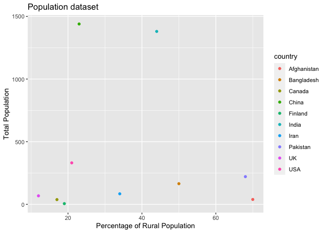
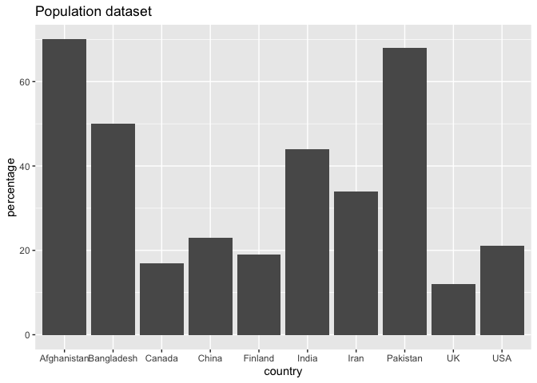
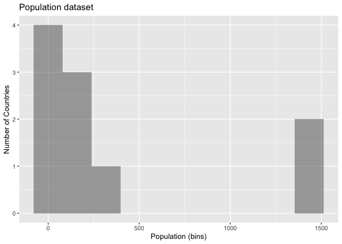
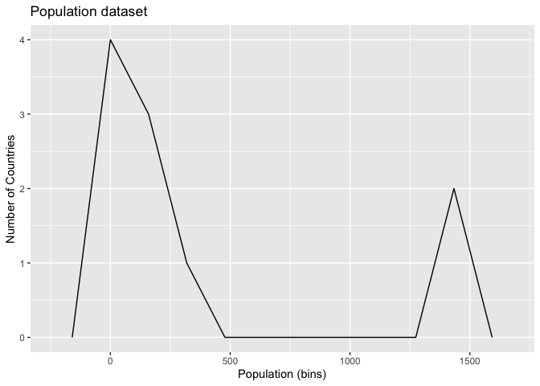
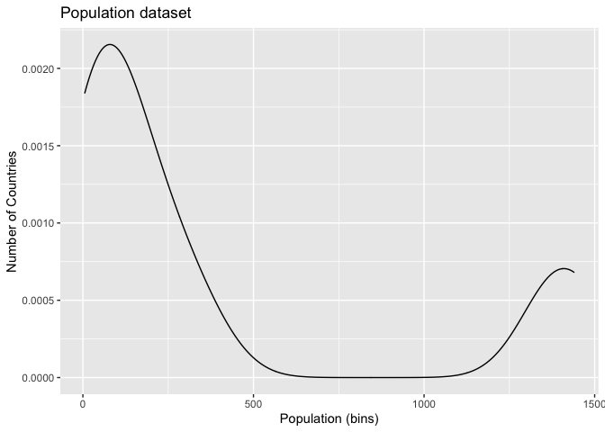
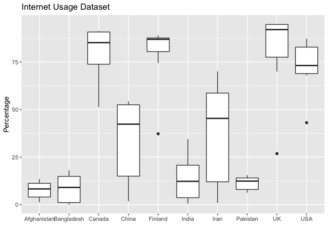
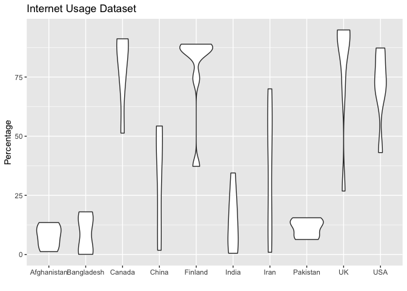
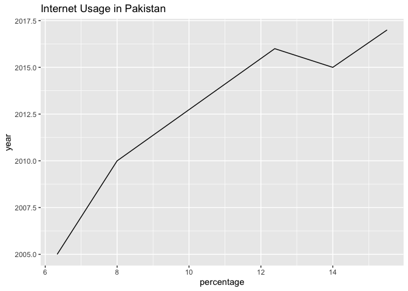
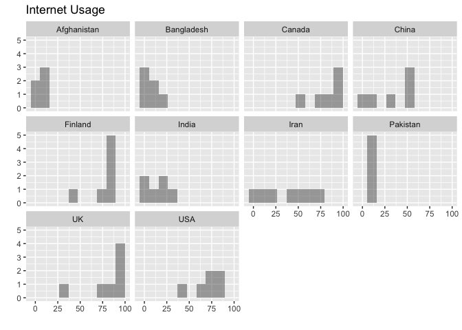

a9 R Notebook
================

Syed Hasan <a href="mailto:syedhass@usc.edu">syedhass@usc.edu</a>

``` r
df <- read.csv("lab/data/population.csv") #filename from Files > Upload
```

## Stem-and-leaf plot

The source of this data is United Nations Population Division, New York,
World Urbanization Prospects: The 2018 Revision. For this Stem-and-leaf
plot I am using Population data for the year 2018, more specifically:

-   Percentage of Population Living in Rural Areas

``` r
stem(df$percentage)
```

    ## 
    ##   The decimal point is 1 digit(s) to the right of the |
    ## 
    ##   0 | 279
    ##   2 | 134
    ##   4 | 40
    ##   6 | 80

## Scatterplot

The source of this data is United Nations Population Division, New York,
World Urbanization Prospects: The 2018 Revision. <br> For this altair
scatterplot I am using Population data for the year 2018, more
specifically:

-   Percentage of Population Living in Rural Areas (x-axis)
-   Total population of the country, in millions (y-axis)

``` r
library("ggplot2")  #use installed package

ggplot(df, aes(x = percentage, y = population, color=country)) + #data and mappings
 geom_point() + 
 xlab('Percentage of Rural Population') +
 ylab('Total Population') +
 ggtitle('Population dataset')
```

<!-- -->

## Barchart

The source of this data is United Nations Population Division, New York,
World Urbanization Prospects: The 2018 Revision. <br> For this altair
barchart I am using Population data for the year 2018, more
specifically:

-   Percentage of Population Living in Rural Areas (y-axis)
-   Country (x-axis)

``` r
ggplot(df, aes(country, percentage)) +
 geom_col() +
 ggtitle('Population dataset')
```

<!-- -->

## Histogram

The source of this data is United Nations Population Division, New York,
World Urbanization Prospects: The 2018 Revision. <br> For this histogram
I am using Population data for the year 2018, more specifically:

-   Population of countries, binned into bins of 200 million (x-axis)
-   Number of countries (y-axis)

``` r
ggplot(df, aes(x = population)) +
 geom_histogram(bins = 10, alpha=0.5) + 
 xlab('Population (bins)') +
 ylab('Number of Countries') +
 ggtitle('Population dataset')
```

<!-- -->

## Frequency Polygon

The source of this data is United Nations Population Division, New York,
World Urbanization Prospects: The 2018 Revision. <br> For this frequency
polygon I am using Population data for the year 2018, more specifically:

-   Population of countries, binned into bins of 200 million (x-axis)
-   Number of countries (y-axis)

``` r
ggplot(df, aes(x = population)) +
  geom_freqpoly(bins = 10) + 
 xlab('Population (bins)') +
 ylab('Number of Countries') +
 ggtitle('Population dataset')
```

<!-- -->

## Smoothed Density Estimate

The source of this data is United Nations Population Division, New York,
World Urbanization Prospects: The 2018 Revision. <br> For this smoothed
density estimate I am using Population data for the year 2018, more
specifically:

-   Population of countries, binned into bins of 200 million (x-axis)
-   Number of countries (y-axis)

``` r
ggplot(df, aes(x = population)) +
 geom_density() + 
 xlab('Population (bins)') +
 ylab('Number of Countries') +
  ggtitle('Population dataset')
```

<!-- -->

## Boxplot

For this boxplot I am using Communication data, more specifically
Internet Usage data. <br> The source of this data is International
Telecommunication Union (ITU) based in Geneva.

-   Comparing the percentage of people who use the internet from
    countries in my region (south Asia) against more developed countries
    in the years 2000-2020

``` r
internet <- read.csv("lab/data/internet_.csv") #filename from Files > Upload

ggplot(internet, aes(x = country, y = percentage)) +
 geom_boxplot(notch=FALSE)+  #default is not to use notches+ 
 xlab('') +
 ylab('Percentage') +
  ggtitle('Internet Usage Dataset')
```

<!-- -->

## Violin Plot

For this violin plot I am using Communication data, more specifically
Internet Usage data. <br> The source of this data is International
Telecommunication Union (ITU) based in Geneva.

-   Comparing the percentage of people who use the internet from
    countries in my region (south Asia) against more developed countries
    in the years 2000-2020

``` r
ggplot(internet, aes(x = country, y = percentage)) +
 geom_violin() +  #default is not to use notches+ 
 xlab('') +
 ylab('Percentage') +
 ggtitle('Internet Usage Dataset')
```

<!-- -->

## Line Chart

For this line chart I am using Communication data, more specifically
Internet Usage data. The source of this data is International
Telecommunication Union (ITU) based in Geneva.

-   Plotting the percentage of people in Pakistan, using the internet
    from years 2005-2018

``` r
ggplot(internet[internet$country == 'Pakistan',], aes(x = percentage, y = year))+ geom_line() + 
 xlab('percentage') +
 ylab('year') +
 ggtitle('Internet Usage in Pakistan')
```

<!-- -->

## Trellis Plot

For this trellis plot I am using Communication data, more specifically
Internet Usage data. <br> The source of this data is International
Telecommunication Union (ITU) based in Geneva.

-   Plotting the percentage of people (in a barchart) using internet in
    different countries, from years 2005-2018

``` r
internet$country = factor(internet$country, levels=c("Afghanistan", "Bangladesh", "Canada", "China","Finland","India","Iran","Pakistan","UK","USA"))

p <- ggplot(internet, aes(x = percentage)) +
 xlab('') +
 ylab('') +
 ggtitle('Internet Usage') + 
 geom_histogram(bins = 10, alpha=0.5)

p + facet_wrap(facets=vars(country))
```

<!-- -->
