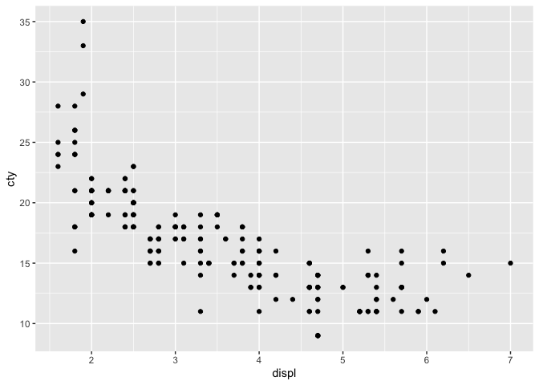
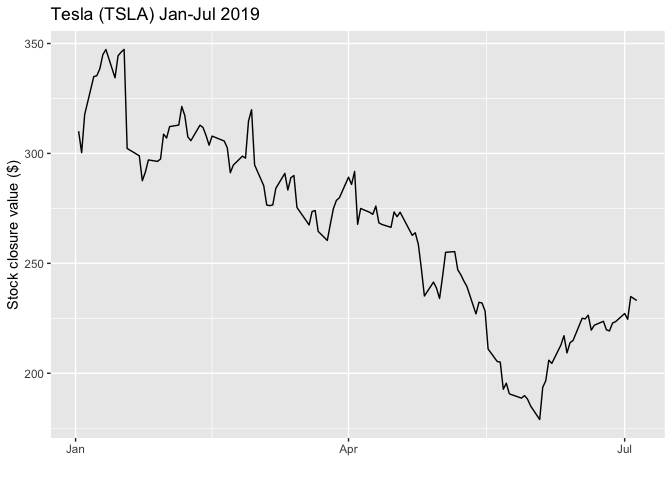

R Notebook
================

``` r
#output: html_notebook
#knitr::opts_chunk$set(echo=FALSE)
```

# 🏋 ex2 R ggplot2

To get started with `ggplot2` you need to install and load the `ggplot2`
package:

``` r
#install.packages("ggplot2")   #install package once
library("ggplot2")  #use installed package
```

ggplot2 comes with several datasets, you can list the datasets in the
ggplot2 package with:

``` r
data(package = 'ggplot2')
```

# Scatterplots

Scatterplots are realized with the point geom.

Read the docs for `geom_point`

``` r
?geom_point
```

Minimal plot with Data and Mapping set in Defaults layer:

``` r
ggplot(mpg, aes(x = displ, y = cty)) + #data and mappings
 geom_point() #geometry
```

<!-- -->

Minimal with with data and mappings set in Geom layer

``` r
ggplot() + geom_point(data=mpg, mapping=aes(displ, cty))  #same not using default mappings
```

<!-- -->

You can use transparency to deal with overplotting:

``` r
ggplot() + geom_point(data=mpg, mapping=aes(displ, cty), alpha=0.5)  #same not using default mappings
```

<!-- -->

You can use the `geom_count` a variant geom_point() that counts the
number of observations at each location, then maps the count to point
area. It useful when you have discrete data and overplotting.

Read the docs with `?geom_count`.

``` r
?geom_count()
```

``` r
ggplot(mpg, aes(cty, hwy)) +
 geom_count()
```

<!-- -->

Another way to deal with overplotting is to use `geom_jitter`. Note that
`geom_jitter()` is a shortcut for `geom_point(position = "jitter")`.

Read the docs with `?geom_jitter`

``` r
?geom_jitter
```

``` r
p <- ggplot(mpg, aes(cyl, hwy))
p + geom_point()
```

<!-- -->

``` r
p + geom_jitter()
```

<!-- -->

# Heatmap of 2d bin counts

The `geom_bin_2d` geom divides the plane into rectangles, counts the
number of cases in each rectangle, and then (by default) maps the number
of cases to the rectangle’s fill. This is a useful alternative to
geom_point() in the presence of overplotting.

``` r
d <- ggplot(diamonds, aes(x, y)) + xlim(4, 10) + ylim(4, 10)
d + geom_bin_2d()
```

    ## Warning: Removed 478 rows containing non-finite values (stat_bin2d).

<!-- -->

# Bar chart

Bar charts are realized with the `geom_bar`

Read the docs with `?geom_bar`

``` r
?geom_bar()
```

``` r
ggplot(mpg, aes(x = manufacturer)) +
 geom_bar()
```

<!-- -->

Note that the geom_bar() `stat` (the statistical transformation)
defaults to ‘count’.

If you already have the counts you need to set `stat = 'identity'` or
use `geom_col` that uses stat identity.

``` r
df <- data.frame(trt = c("a", "b", "c"), outcome = c(2.3, 1.9, 3.2))

ggplot(df, aes(trt, outcome)) +
  geom_col()
```

<!-- -->

``` r
ggplot(df, aes(trt, outcome)) +
  geom_bar(stat = 'identity')
```

<!-- -->

# Histogram and frequency polygons

Histograms are realized using `geom_histogram`. Frequency polygons are
realized using `geom_freqpoly`.

Read the docs with `?geom_histogram` and `?geom_freqpoly`

``` r
?geom_histogram()
```

``` r
?geom_freqpoly()
```

``` r
ggplot(mpg, aes(x = hwy)) +
 geom_histogram()
```

    ## `stat_bin()` using `bins = 30`. Pick better value with `binwidth`.

<!-- -->

``` r
ggplot(mpg, aes(x = hwy)) +
 geom_histogram(bins = 15)
```

<!-- -->

``` r
ggplot(mpg, aes(x = hwy)) +
  geom_freqpoly()
```

    ## `stat_bin()` using `bins = 30`. Pick better value with `binwidth`.

<!-- -->

``` r
ggplot(mpg, aes(x = hwy)) +
 geom_histogram() +
  geom_freqpoly()
```

    ## `stat_bin()` using `bins = 30`. Pick better value with `binwidth`.
    ## `stat_bin()` using `bins = 30`. Pick better value with `binwidth`.

<!-- --> #
Smoothed density estimates

Smoothed density estimates are realized with the `geom_density` geom.

`geom_density` computes and draws kernel density estimate, which is a
smoothed version of the histogram. This is a useful alternative to the
histogram for continuous data that comes from an underlying smooth
distribution.

Read the docs with `?geom_density`

``` r
?geom_density()
```

``` r
ggplot(mpg, aes(x = hwy)) +
 geom_density()
```

<!-- -->

# Boxplot

Boxplots are realized with the `geom_boxplot` geom.

Read the docs with `?geom_boxplot`

``` r
?geom_boxplot()
```

``` r
ggplot(mpg, aes(x = manufacturer, y = hwy)) +
 geom_boxplot(notch=FALSE)  #default is not to use notches
```

<!-- -->

# Violin plot

Violin are realized with the `geom_violin` geom.

Read the docs with `?geom_violin`

``` r
?geom_violin()
```

``` r
ggplot(mpg, aes(x = manufacturer, y = hwy)) +
 geom_violin()
```

<!-- -->

# Line chart

Line chart are realized with the `geom_line` geom.

Read the docs with `?geom_line`

``` r
?geom_line
```

``` r
ggplot(economics, aes(date, unemploy))+ geom_line()
```

<!-- --> And
here is a simpler example

``` r
xval <- 1:10
yval <- cumsum(rnorm(10))
data <- data.frame(xval, yval)

data
```

    ##    xval       yval
    ## 1     1 -0.8381054
    ## 2     2 -0.7924695
    ## 3     3 -0.3267266
    ## 4     4 -2.3309335
    ## 5     5  0.2393596
    ## 6     6  0.5850389
    ## 7     7  2.6575184
    ## 8     8  1.6923110
    ## 9     9  1.8080492
    ## 10   10  2.5500015

``` r
ggplot(data, aes(x = xval, y = yval)) +
  geom_line()
```

<!-- --> #
Trellis plot (faceting)

You can generate trellis plots in ggplot2 using `facet_wrap()` or
`facet_grid()`

Read the docs online with `?ggplot2::facet_wrap` and
`?ggplot2::facet_grid`

``` r
?ggplot2::facet_wrap
```

``` r
?ggplot2::facet_grid
```

``` r
p <- ggplot(mpg, aes(displ, hwy)) + geom_point()

# Use vars() to supply faceting variables:
p + facet_wrap(vars(class))
```

<!-- -->

``` r
# Control the number of rows and columns with nrow and ncol
p + facet_wrap(vars(class), nrow = 4)
```

<!-- --> #
Customizations

See [Modify axis, legend, and plot
labels](https://ggplot2.tidyverse.org/reference/labs.html)

Note that in the following we map color to categories and ggplot2
creates a legend with a default categorical color scale.

``` r
head(mtcars)  #print top rows in cars dataframe
```

    ##                    mpg cyl disp  hp drat    wt  qsec vs am gear carb
    ## Mazda RX4         21.0   6  160 110 3.90 2.620 16.46  0  1    4    4
    ## Mazda RX4 Wag     21.0   6  160 110 3.90 2.875 17.02  0  1    4    4
    ## Datsun 710        22.8   4  108  93 3.85 2.320 18.61  1  1    4    1
    ## Hornet 4 Drive    21.4   6  258 110 3.08 3.215 19.44  1  0    3    1
    ## Hornet Sportabout 18.7   8  360 175 3.15 3.440 17.02  0  0    3    2
    ## Valiant           18.1   6  225 105 2.76 3.460 20.22  1  0    3    1

``` r
# set defaults
p <- ggplot(mpg, aes(x = displ, y = cty, color = manufacturer))
#add transparency 
p <- p + geom_point(alpha=0.5)

#add axes labels and title
p <- p + xlab('displacement') +
 ylab('city (mpg)') +
 ggtitle('mpg dataset')

#plot
p
```

<!-- -->

------------------------------------------------------------------------

# Exercises

## 🤔 Exercise 1

Create a scatterplot of the `iris` dataset:

-   map `x` to `Sepal.Length`
-   map `y` to `Sepal.Width`
-   map `color` to `Species`
-   use geom point `alpha` to `0.5`
-   add jitter with the geom `geom_jitter()`
-   set x axis label to ‘Sepal length (cm)’
-   set y axis label to ‘Sepal width (cm)’
-   set title label to ‘Iris dataset’

``` r
head(iris)
```

    ##   Sepal.Length Sepal.Width Petal.Length Petal.Width Species
    ## 1          5.1         3.5          1.4         0.2  setosa
    ## 2          4.9         3.0          1.4         0.2  setosa
    ## 3          4.7         3.2          1.3         0.2  setosa
    ## 4          4.6         3.1          1.5         0.2  setosa
    ## 5          5.0         3.6          1.4         0.2  setosa
    ## 6          5.4         3.9          1.7         0.4  setosa

``` r
ggplot(iris, aes(x = Sepal.Length, y = Sepal.Width, color=Species)) + #data and mappings
 geom_point(alpha=0.5) +  #geometry 
 geom_jitter() + 
 xlab('Sepal length (cm)') +
 ylab('Sepal width (cm)') +
 ggtitle('Iris dataset')
```

<!-- -->

## 😜 Exercise 2

Create a scatterplot of the `iris` dataset:

-   map `x` to `Sepal.Length`
-   map `y` to `Sepal.Width`
-   map `color` to `Species`
-   map `size` to `Petal.Length`
-   set geom point `alpha` to `0.5`
-   set x axis label to ‘Sepal length (cm)’
-   set y axis label to ‘Sepal width (cm)’
-   set title label to ‘Iris dataset’

``` r
head(iris)
```

    ##   Sepal.Length Sepal.Width Petal.Length Petal.Width Species
    ## 1          5.1         3.5          1.4         0.2  setosa
    ## 2          4.9         3.0          1.4         0.2  setosa
    ## 3          4.7         3.2          1.3         0.2  setosa
    ## 4          4.6         3.1          1.5         0.2  setosa
    ## 5          5.0         3.6          1.4         0.2  setosa
    ## 6          5.4         3.9          1.7         0.4  setosa

``` r
ggplot(iris, aes(x = Sepal.Length, y = Sepal.Width, color=Species, size=Petal.Length)) + #data and mappings
 geom_point(alpha=0.5) +  #geometry 
 xlab('Sepal length (cm)') +
 ylab('Sepal width (cm)') +
 ggtitle('Iris dataset')
```

<!-- -->

## 😜 Exercise 3

Create a scatterplot of the `SMO-VOR-2015.csv` dataset:

-   map `x` to `ptime`
-   map `y` to `alt`
-   map `color` to `month`
-   set geom point `alpha` to `0.1`
-   set x axis label to ‘Penetration time’
-   set y axis label to ‘Altitude (feets)’
-   set title label to ‘SMO VOR 2015 dataset’
-   add smooth regression line with `p + geom_smooth()` where `p` is
    your plot

**What happens if `month` is not a factor with ordered levels:**
<!-- you answer here --> **We will get the default ordering, which will
be alphabetic**

``` r
df = read.csv('data/SMO-VOR-2015.csv')

#convert `ptime` to datetime
df$ptime <- as.POSIXct(df$ptime,"%Y-%m-%d %H:%M:%S", tz = "America/Los_Angeles")

#set `month` as factor with ordered levels
df$month = factor(df$month, levels=c("Jan", "Feb", "Mar", "Apr", "May", "Jun", "Jul", "Aug", "Sep", "Oct", "Nov", "Dec"))

head(df)
```

    ##    flight   icao  alt      lat       lon      dist               ptime month
    ## 1  CCA983 7809AA 6933 34.01102 -118.4572  97.83333 2015-03-01 16:17:18   Mar
    ## 2  UAL199 A31961 7588 34.01209 -118.4583 208.90367 2015-03-01 16:22:59   Mar
    ## 3    THY9 4BA94D 8348 34.01116 -118.4562 176.09848 2015-03-01 16:26:21   Mar
    ## 4     472 A59D63 7802 34.01162 -118.4591 194.91334 2015-03-01 16:31:17   Mar
    ## 5 UAL1636 AA56DB 7445 34.01170 -118.4583 166.58116 2015-03-01 23:16:49   Mar
    ## 6 DAL1434 A78605 7116 34.01637 -118.4518 871.27273 2015-03-01 23:26:00   Mar
    ##   hour weekday ops
    ## 1   16     Sun Day
    ## 2   16     Sun Day
    ## 3   16     Sun Day
    ## 4   16     Sun Day
    ## 5   23     Sun Day
    ## 6   23     Sun Day

``` r
ggplot(df, aes(x = ptime, y = alt, color=month)) + #data and mappings
 geom_point(alpha=0.1) +  #geometry
 xlab('Penetration time') +
 ylab('Altitude (feets)') +
 ggtitle('SMO VOR 2015 dataset')
```

<!-- -->

## 😜 Exercise 4

Create a scatterplot of the `SMO-VOR-2015.csv` dataset:

-   map `x` to `month`
-   map `y` to `alt`
-   map `color` to `alt`
-   set geom point `alpha` to `0.1`
-   add jitter to geom point
-   set x axis label to ’’
-   set y axis label to ‘Altitude (feets)’
-   set title label to ‘SMO VOR 2015 dataset’
-   set a sequential gradient scale with
    `p + scale_color_gradient(low = "red", high = "blue")` where `p` is
    your plot

``` r
df = read.csv('data/SMO-VOR-2015.csv')

df$month = factor(df$month, levels=c("Jan", "Feb", "Mar", "Apr", "May", "Jun", "Jul", "Aug", "Sep", "Oct", "Nov", "Dec"))

head(df)
```

    ##    flight   icao  alt      lat       lon      dist               ptime month
    ## 1  CCA983 7809AA 6933 34.01102 -118.4572  97.83333 2015-03-01 16:17:18   Mar
    ## 2  UAL199 A31961 7588 34.01209 -118.4583 208.90367 2015-03-01 16:22:59   Mar
    ## 3    THY9 4BA94D 8348 34.01116 -118.4562 176.09848 2015-03-01 16:26:21   Mar
    ## 4     472 A59D63 7802 34.01162 -118.4591 194.91334 2015-03-01 16:31:17   Mar
    ## 5 UAL1636 AA56DB 7445 34.01170 -118.4583 166.58116 2015-03-01 23:16:49   Mar
    ## 6 DAL1434 A78605 7116 34.01637 -118.4518 871.27273 2015-03-01 23:26:00   Mar
    ##   hour weekday ops
    ## 1   16     Sun Day
    ## 2   16     Sun Day
    ## 3   16     Sun Day
    ## 4   16     Sun Day
    ## 5   23     Sun Day
    ## 6   23     Sun Day

``` r
ggplot(df, aes(x = month, y = alt, color=alt)) + #data and mappings
 geom_point(alpha=0.1) +  #geometry
 geom_jitter() + 
 xlab('') +
 ylab('Altitude (feets)') +
 ggtitle('SMO VOR 2015 dataset') + 
 scale_color_gradient(low = "red", high = "blue")
```

<!-- -->

## 😜 Exercise 5

Create a bar chart of the `SMO-VOR-2015.csv` dataset:

-   map `x` to `month`
-   set x axis label to ’’
-   set y axis label to ‘Count’
-   set title label to ‘SMO VOR 2015 dataset’

Note that you can check the counts by filtering by month in the
dataframe table view.

``` r
df = read.csv('data/SMO-VOR-2015.csv')

df$month = factor(df$month, levels=c("Jan", "Feb", "Mar", "Apr", "May", "Jun", "Jul", "Aug", "Sep", "Oct", "Nov", "Dec"))

head(df)
```

    ##    flight   icao  alt      lat       lon      dist               ptime month
    ## 1  CCA983 7809AA 6933 34.01102 -118.4572  97.83333 2015-03-01 16:17:18   Mar
    ## 2  UAL199 A31961 7588 34.01209 -118.4583 208.90367 2015-03-01 16:22:59   Mar
    ## 3    THY9 4BA94D 8348 34.01116 -118.4562 176.09848 2015-03-01 16:26:21   Mar
    ## 4     472 A59D63 7802 34.01162 -118.4591 194.91334 2015-03-01 16:31:17   Mar
    ## 5 UAL1636 AA56DB 7445 34.01170 -118.4583 166.58116 2015-03-01 23:16:49   Mar
    ## 6 DAL1434 A78605 7116 34.01637 -118.4518 871.27273 2015-03-01 23:26:00   Mar
    ##   hour weekday ops
    ## 1   16     Sun Day
    ## 2   16     Sun Day
    ## 3   16     Sun Day
    ## 4   16     Sun Day
    ## 5   23     Sun Day
    ## 6   23     Sun Day

``` r
ggplot(df, aes(x = month)) +
geom_bar() + 
xlab('') +
ylab('Count') +
  ggtitle('SMO VOR 2015 dataset')
```

<!-- -->

## 😜 Exercise 6

Create a line chart of the `TSLA.csv` dataset:

-   map `x` to `Date`
-   map `y` to `Close`
-   set x axis label to ’’
-   set y axis label to ‘Stock closure value ($)’
-   set title label to ‘Tesla (TSLA) Jan-Jul 2019’

``` r
df = read.csv('data/TSLA.csv')
df$Date <- as.POSIXct(df$Date, "%Y-%m-%d", tz = "America/Los_Angeles")

head(df)
```

    ##         Date   Open   High    Low  Close Adj.Close   Volume
    ## 1 2019-01-02 306.10 315.13 298.80 310.12    310.12 11658600
    ## 2 2019-01-03 307.00 309.40 297.38 300.36    300.36  6954400
    ## 3 2019-01-04 306.00 318.00 302.73 317.69    317.69  7394100
    ## 4 2019-01-07 321.72 336.74 317.75 334.96    334.96  7551200
    ## 5 2019-01-08 341.96 344.01 327.02 335.35    335.35  7008500
    ## 6 2019-01-09 335.50 343.50 331.47 338.53    338.53  5432900

``` r
ggplot(df, aes(Date, Close))+ geom_line() + 
 xlab('') +
 ylab('Stock closure value ($)') +
 ggtitle('Tesla (TSLA) Jan-Jul 2019')
```

<!-- -->

## 🤔 Exercise 7

Create a scatterplot of the `SMO-VOR-2015.csv` dataset with a boxplot
superimposed:

Set default mappings:

-   map `x` to `month`
-   map `y` to `alt`
-   set x axis label to ’’
-   set y axis label to ‘Altitude (feets)’
-   set title label to ‘SMO VOR 2015 dataset’

Add geom point layer:

-   map `color` to `alt` (must use `aes(color=alt)`)
-   set geom point `alpha` to `0.1`
-   add jitter to geom point

Add geom boxplot layer:

-   add geom boxplot layer
-   set geom boxplot `alpha` to `0.3`

``` r
df = read.csv('data/SMO-VOR-2015.csv')

df$month = factor(df$month, levels=c("Jan", "Feb", "Mar", "Apr", "May", "Jun", "Jul", "Aug", "Sep", "Oct", "Nov", "Dec"))

head(df)
```

    ##    flight   icao  alt      lat       lon      dist               ptime month
    ## 1  CCA983 7809AA 6933 34.01102 -118.4572  97.83333 2015-03-01 16:17:18   Mar
    ## 2  UAL199 A31961 7588 34.01209 -118.4583 208.90367 2015-03-01 16:22:59   Mar
    ## 3    THY9 4BA94D 8348 34.01116 -118.4562 176.09848 2015-03-01 16:26:21   Mar
    ## 4     472 A59D63 7802 34.01162 -118.4591 194.91334 2015-03-01 16:31:17   Mar
    ## 5 UAL1636 AA56DB 7445 34.01170 -118.4583 166.58116 2015-03-01 23:16:49   Mar
    ## 6 DAL1434 A78605 7116 34.01637 -118.4518 871.27273 2015-03-01 23:26:00   Mar
    ##   hour weekday ops
    ## 1   16     Sun Day
    ## 2   16     Sun Day
    ## 3   16     Sun Day
    ## 4   16     Sun Day
    ## 5   23     Sun Day
    ## 6   23     Sun Day

``` r
ggplot(df, aes(x = month, y = alt)) + #data and mappings
 geom_jitter() + 
 xlab('') +
 ylab('Altitude (feets)') +
 ggtitle('SMO VOR 2015 dataset') + 
 geom_point(aes(color=alt), alpha=0.1, position = "jitter") +  #geometry
 geom_boxplot(notch=FALSE, alpha=0.3)
```

<!-- -->

## 😜 Exercise 8

Create a histogram of the `SMO-VOR-2015.csv` dataset:

-   map `x` to `alt`
-   set x axis label to ‘Altitude (feets)’
-   set y axis label to ‘Counts’
-   set title label to ‘SMO VOR 2015 dataset’
-   add geom histogram
-   set geom histogram `alpha` to `0.5` so we can see the grid lines

``` r
df = read.csv('data/SMO-VOR-2015.csv')

ggplot(df, aes(x = alt)) +
 xlab('Altitude (feets)') +
 ylab('Counts') +
 ggtitle('SMO VOR 2015 dataset') + 
 geom_histogram(alpha=0.5)
```

    ## `stat_bin()` using `bins = 30`. Pick better value with `binwidth`.

<!-- -->

## 😜 Exercise 9

Create a trellis plot with histograms of the `SMO-VOR-2015.csv` dataset
faceted by month:

-   map `x` to `alt`
-   set x axis label to ‘Altitude (feets)’
-   set y axis label to ‘Counts’
-   set title label to ‘SMO VOR 2015 dataset’
-   add geom histogram
-   set geom histogram `alpha` to `0.5` so we can see the grid lines
-   add faceting with `p + facet_wrap(facets=vars(month))` where `p` is
    your plot

Note that `p + facet_wrap(facets=vars(month))` is the same as
`p + facet_wrap(~month)`

``` r
df = read.csv('data/SMO-VOR-2015.csv')

df$month = factor(df$month, levels=c("Jan", "Feb", "Mar", "Apr", "May", "Jun", "Jul", "Aug", "Sep", "Oct", "Nov", "Dec"))

p <- ggplot(df, aes(x = alt)) +
 xlab('Altitude (feets)') +
 ylab('Counts') +
 ggtitle('SMO VOR 2015 dataset') + 
 geom_histogram(bins = 25, alpha=0.5)

p + facet_wrap(facets=vars(month))
```

<!-- -->

## 😜 Exercise 10

Render and submit your work.
